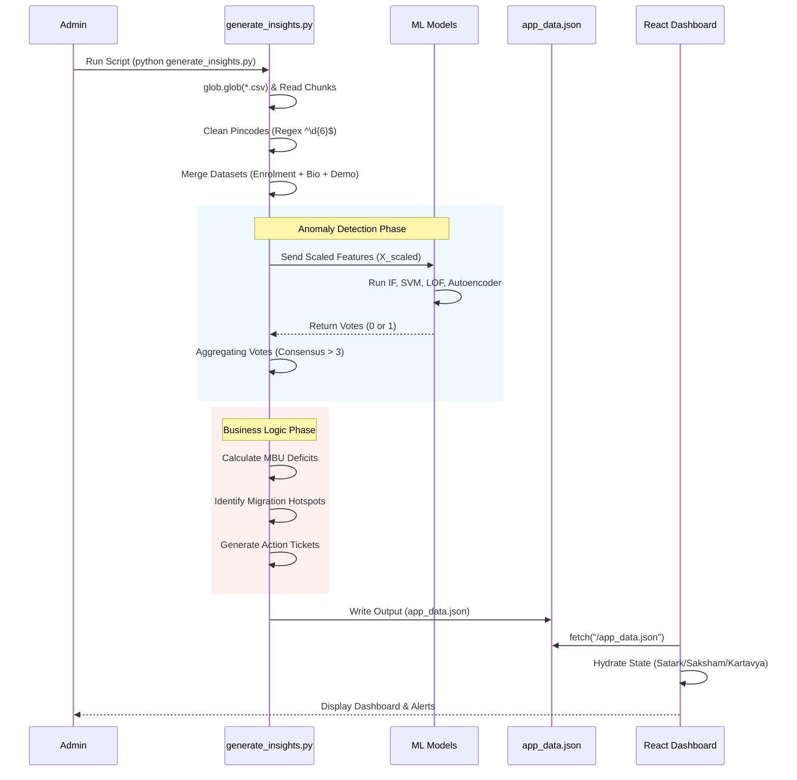

# TECHNICAL_DEEP_DIVE.md

## 1. High-Level Summary

**One-liner:** A high-performance analytics dashboard and data processing engine that ingests raw Aadhaar enrolment data to identify operational inefficiencies, detect fraud, and optimize resource allocation for government administrators.

**Problem Solved:**
Government administrators lack a unified view of Aadhaar enrolment operations. They struggle to manually correlate disparate datasets (Enrolment, Biometric, Demographic) to identify "Mandatory Biometric Update" (MBU) deficits, detect fraudulent adult enrolments, or spot migration-driven demographic shifts in real-time. This project automates this correlation to generate actionable "Tickets" for immediate intervention.

**Target Audience:**
UIDAI Administrators, Regional Enrolment Managers, and Hackathon Judges looking for operational intelligence tools.

---

## 2. Technical Stack

### Frontend (Dashboard)
*   **Framework:** React 18 (Vite)
*   **Styling:** Tailwind CSS (Government Tech Design System)
*   **State Management:** React Hooks / Context API
*   **Visualization:** Recharts (ComposedCharts, PieCharts, ScatterPlots), Lucide React (Icons)
*   **Animations:** Framer Motion (Page transitions and micro-interactions)
*   **Routing:** React Router DOM
*   **Data Source:** Static JSON (`app_data.json`) generated by the backend.

### Backend (Data Engine)
*   **Language:** Python 3.10+
*   **Core Logic:** `generate_insights.py`
*   **Data Processing:** Pandas (Chunked CSV processing for memory efficiency), NumPy
*   **Machine Learning (Fraud Detection):**
    *   **Ensemble Strategy:** Consensus Voting Mechanism
    *   **Models:**
        1.  **Isolation Forest** (Scikit-learn)
        2.  **One-Class SVM** (Scikit-learn)
        3.  **Local Outlier Factor** (Scikit-learn)
        4.  **Autoencoder** (TensorFlow/Keras - *with graceful fallback*)
*   **Data Normalization:** Scikit-learn (`StandardScaler`)

### Infrastructure & Deployment
*   **Runtime:** Local Python Environment (for data batch processing)
*   **Storage:** Local File System (CSV inputs, JSON output)
*   **Version Control:** Git

---

## 3. Key Features & Implementation Details

### A. Ensemble Anomaly Detection (Fraud Detection)
**Logic:** Identifies pincodes with suspicious patterns of adult enrolments (`age_18_greater`) relative to biometric/demographic updates. It uses a "Consensus Voting" system where a pincode is flagged only if multiple algorithms agree.

**Key File:** `generate_insights.py` (Functions: `run_ensemble_voting`, `prepare_features`)

**Algorithms:**
1.  **Feature Engineering:**
    *   Combines `age_18_greater` (Enrolment), `bio_age_17_` (Biometric), and `demo_age_17_` (Demographic).
    *   Fills missing data with 0 and applies `StandardScaler` to normalize features for distance-based algorithms (SVM/LOF).
2.  **Voting Logic:**
    *   `Fraud Vote Threshold`: 3 (Default). A pincode must be voted as an anomaly by at least 3 out of 4 models to be marked "High Risk".
    *   **Autoencoder:** Uses Reconstruction Error (MSE). If the error exceeds the 90th percentile, it votes "Anomaly".

### B. MBU (Mandatory Biometric Update) Deficit Tracking
**Logic:** Calculates the gap between children who turned 5/15 and those who actually updated their biometrics.
*   Formula: `Deficit = Enrolment[age_5_17] - Biometric[bio_age_5_17]`

**Key File:** `generate_insights.py` (Function: `generate_mbu_compliance_tickets`)

**Implementation:**
*   Merges Enrolment and Biometric dataframes on `pincode`.
*   Filters for deficits > `mbu_deficit_threshold` (Default: 500).
*   Generates "High Priority" tickets for "MBU Camps" at specific venues (e.g., Schools).

### C. Migration Hotspot Identification
**Logic:** Detects "Boom Towns" - areas with high adult inflow but low child population, indicating labor migration.

**Key File:** `generate_insights.py` (Function: `generate_migration_hotspot_tickets`)

**Algorithms:**
*   **Percentile Filtering:**
    *   Condition 1: `demo_age_17_` (Adult Demographic Updates) is in the **Top 90th Percentile** (Upper Extreme).
    *   Condition 2: `age_0_5` (New Child Enrolments) is in the **Bottom 20th Percentile** (Lower Extreme).
*   Result: Triggers "Urban Planning Survey" tickets.

### D. Automated WhatsApp Integration (Simulation)
**Logic:** Pre-formats `whatsapp://send` links with structured messages for immediate field deployment.

**Key File:** `generate_insights.py`
**Implementation:** Constructs a URL-encoded string containing Ticket Priority, District, Pincode, and Action Items, embedded directly into the ticket JSON object (`ticket['whatsapp_msg']`).

---

## 4. Architecture & Data Flow

### A. System Architecture Diagram

```mermaid
graph TD
    subgraph Data_Layer [Data Layer]
        CSV_Enrol[Enrolment CSVs]
        CSV_Bio[Biometric CSVs]
        CSV_Demo[Demographic CSVs]
    end

    subgraph Backend_Engine [Backend Engine (Python)]
        Ingest[Data Ingestion (Chunked Loading)]
        Preproc[Preprocessing & Cleaning]
        Ensemble[ML Ensemble (IF, SVM, LOF, AE)]
        Rules[Business Rule Engine]
        JSON_Gen[JSON Generator]
    end

    subgraph Frontend_App [Frontend Dashboard (React)]
        Store[Data Store (app_data.json)]
        UI_Satark[Satark (Security View)]
        UI_Saksham[Saksham (Compliance View)]
        UI_Kartavya[Kartavya (Action Center)]
        UI_Pravas[Pravas (Migration View)]
    end

    CSV_Enrol --> Ingest
    CSV_Bio --> Ingest
    CSV_Demo --> Ingest
    Ingest --> Preproc
    Preproc --> Ensemble
    Preproc --> Rules
    Ensemble --> Rules
    Rules --> JSON_Gen
    JSON_Gen --> Store
    Store --> UI_Satark
    Store --> UI_Saksham
    Store --> UI_Kartavya
    Store --> UI_Pravas
```

### B. Data Processing Pipeline Flow



---

## 5. Challenges & Solutions

### Challenge 1: Handling Inconsistent Postal Codes (Dirty Data)
**Problem:** Raw CSV data often contains invalid pincodes (e.g., "  110001 ", "A123", or whitespace issues) that break aggregation logic.
**Solution:** Implemented a robust `clean_pincode` function in `generate_insights.py`.
*   **Technique:** Uses Regex (`^\d{6}$`) to strictly validate 6-digit formatting.
*   **Code:** `df['pincode'].astype(str).str.strip()` followed by `df[mask]`. This ensures the merge keys for Enrolment/Biometric datasets are perfectly aligned.

### Challenge 2: Reducing False Positives in Fraud Detection
**Problem:** Single outlier detection algorithms (like Isolation Forest) can be noisy, flagging legitimate high-volume centers as "Fraud".
**Solution:** Implemented a **4-Model Ensemble Voting System**.
*   **Technique:** A pincode is only flagged if *multiple* mathematically distinct algorithms agree.
*   **Benefit:** Combines the strengths of density-based (LOF), boundary-based (SVM), and reconstruction-based (Autoencoder) methods. The `fraud_vote_threshold` configuration allows tuning sensitivity.

### Challenge 3: Processing Large Multi-Part CSVs
**Problem:** The raw data is split across multiple files (chunks) and can be large enough to strain memory if loaded inefficiently.
**Solution:** Created a `load_csv_chunks` generator-like function.
*   **Technique:** Uses `glob` to find all matching patterns, reads them sequentially with `usecols` (loading only necessary columns), and concatenates them.
*   **Optimization:** `low_memory=False` and strict column filtering prevent loading gigabytes of unused columns.

---

## 6. Installation & Setup

### Prerequisites
*   **Node.js:** v18+ (For Frontend)
*   **Python:** 3.10+ (For Backend)
*   **OS:** Windows/Mac/Linux

### Backend Setup (Data Engine)
1.  **Navigate to Backend Directory:**
    ```bash
    cd UIDAI-Hackathon-Backend
    ```
2.  **Create Virtual Environment:**
    ```bash
    python -m venv venv
    .\venv\Scripts\activate
    ```
3.  **Install Dependencies:**
    ```bash
    pip install -r requirements.txt
    ```
    *(Critical libs: pandas, scikit-learn, tensorflow)*
4.  **Run Data Pipeline:**
    ```bash
    python generate_insights.py
    ```
    *Generates `app_data.json`*

### Frontend Setup (Dashboard)
1.  **Navigate to Frontend Directory:**
    ```bash
    cd UIDAI-Dashboard-Frontend
    ```
2.  **Install Dependencies:**
    ```bash
    npm install
    # or
    yarn install
    ```
3.  **Link Data:**
    Copy the generated `app_data.json` from Backend to `public/app_data.json` in Frontend.
4.  **Run Development Server:**
    ```bash
    npm run dev
    ```
